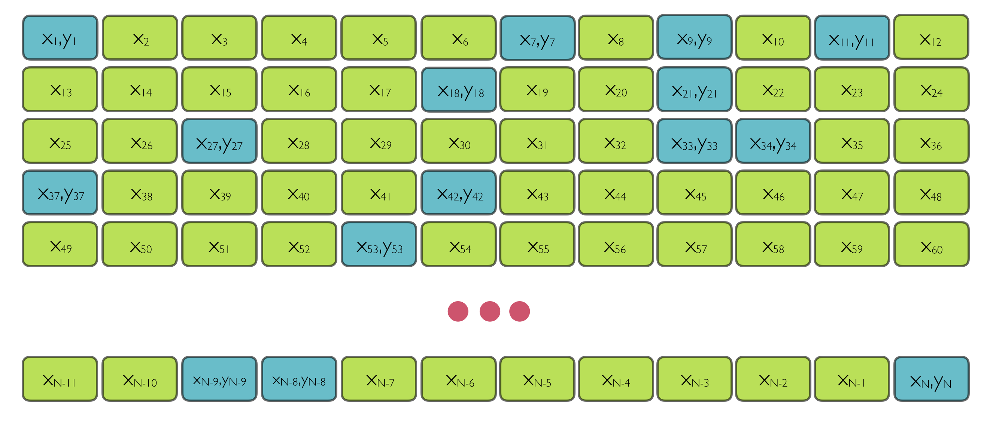

```{r setup, include=FALSE}
knitr::opts_chunk$set(echo = TRUE, message = FALSE, 
                      warning = FALSE, fig.width = 6,
                      fig.height = 4,
                      fig.retina = 3, fig.align = 'center')

options(digits=2, scipen = 3)

# Fix how htmlwidgets are rendered 
# https://stackoverflow.com/questions/65766516/xaringan-presentation-not-displaying-html-widgets-even-when-knitting-provided-t
options(htmltools.preserve.raw = FALSE)
library(knitr)
options(knitr.table.format = "html")
library(tidyverse)
```


class: center, middle


class: title-slide, left, middle
background-image: url("img/mases.001.png")
background-position: right
background-size: contain
background-color: #F1EBD5


.pull-left[

# `mase` Demonstration

### Kelly McConville 

.large[2021 Sixth International Conference on Establishment Statistics]

]


---


## Model-Assisted Survey Estimation

**Goal**: Estimate $t_y = \sum_{i \in U} y_i$.


Data we have:

```{r, echo = FALSE}

```

* Along with first-order inclusion probabilities


---

background-image: url("img/mases.001.png")
background-position: right
background-size: contain
background-color: #F1EBD5


.pull-left[

## Documentation

* [CRAN](https://cran.r-project.org/web/packages/mase/)

```{r, eval = FALSE}
install.packages("mase")
```


* Very Developmental Version:  [GitHub](https://github.com/mcconvil/mase)
    + Recommend installing the CRAN version


]


---

## Estimators in mase


$$\hat{t}_y = \sum_{i \in U} \hat{m}(x_i) + \sum_{i \in s} \frac{y_i - \hat{m}(x_i)}{\pi_i}$$

Where $m(\cdot)$ is:

* Linear regression through the origin: `ratioEstimator()`
* Linear regression: `greg()` (Generalized Regression Estimator)
* Elastic-Net regression: `gregElasticNet()`
* Regression trees: `gregTree()`
    + Uses `rpms`


---

## Example Dataset: `pdxTrees`

.left-column[

```{r, echo = FALSE}

```

]

.right-column[

`r emo::ji("deciduous_tree")` Data from Portland, OR Tree Inventory Project

`r emo::ji("deciduous_tree")` [Vignette](https://cran.r-project.org/web/packages/pdxTrees/vignettes/pdxTrees-vignette.html)

`r emo::ji("deciduous_tree")` [CRAN](https://cran.r-project.org/web/packages/pdxTrees/)

`r emo::ji("deciduous_tree")` [GitHub](https://github.com/mcconvil/pdxTrees)


```{r, message = FALSE, warning = FALSE}
library(tidyverse)
library(pdxTrees)
pop <- get_pdxTrees_parks() %>%
  replace_na(list(Functional_Type = "Unknown")) %>%
  drop_na(DBH, Tree_Height, Condition,
          Functional_Type)
nrow(pop)
```

]


---

## Example Dataset: `pdxTrees`

**Want to estimate the average diameter at breast height**

* Y = `DBH`

* Auxiliary data: X = `Tree_Height`, `Condition`, `Functional_Type`
    + Known for every tree in the population

```{r}
set.seed(44)
samp_SRS <- sample_n(pop, 1000) %>%
  select(DBH, Tree_Height, Condition, Functional_Type) %>%
  mutate(pi = 1000/nrow(pop))
```

---

## Exploratory Data Analysis

```{r}
ggplot(data = samp_SRS, 
       mapping = aes(x = Tree_Height, 
                     y = DBH, 
                     color = Condition,
                     size = 1/pi)) +
  geom_point(alpha = 0.2) +
  geom_smooth(method = "lm", se = FALSE)
```

---

## Exploratory Data Analysis


```{r}
ggplot(data = samp_SRS, 
       mapping = aes(x = Condition, 
                     y = DBH, 
                     fill = Condition)) +
  geom_boxplot() +
  guides(fill = FALSE)
```

---

## Exploratory Data Analysis


```{r}
ggplot(data = samp_SRS, 
       mapping = aes(x = Functional_Type, 
                     y = DBH, 
                     fill = Functional_Type)) +
  geom_boxplot() +
  guides(fill = FALSE)
```

---

### Post-Stratified Estimator

```{r}
library(mase)

x_sample <- select(samp_SRS, Functional_Type, -pi)

x_pop <- select(pop, Functional_Type)

postStrat(y = samp_SRS$DBH, x_sample = x_sample, x_pop = x_pop,
          pi = samp_SRS$pi, var_est = TRUE, data_type = "raw")
```

---

### Generalized Regression Estimator

```{r}
x_sample <- select(samp_SRS, Condition, Tree_Height) %>%
  as.data.frame()

x_pop <- select(pop, names(x_sample))

greg(y = samp_SRS$DBH, x_sample = x_sample, x_pop = x_pop,
          pi = samp_SRS$pi, var_est = TRUE, data_type = "raw")
```


---

### Generalized Regression Estimator with Elastic Net

```{r}
gregElasticNet(y = samp_SRS$DBH, x_sample = x_sample, x_pop = x_pop,
          pi = samp_SRS$pi, var_est = TRUE, data_type = "raw")
```

---

### Generalized Regression Estimator with Regression Trees

```{r}
x_sample <- select(samp_SRS, Functional_Type, Tree_Height) %>%
  mutate(Functional_Type = factor(Functional_Type)) %>%
  as.data.frame() 

x_pop <- select(pop, names(x_sample)) %>%
  mutate(Functional_Type = factor(Functional_Type)) %>%
  as.data.frame()

est <- gregTree(y = samp_SRS$DBH, x_sample = x_sample, 
                x_pop = x_pop, pi = samp_SRS$pi)
est$tree
```


---

### Aggregated Auxiliary Information

* Don't have unit level data for the non-sampled units
* Just have aggregated data

```{r, echo = FALSE}
library(recipes)

x_pop <- select(pop, Condition, Tree_Height)

x_pop_agg <- recipe(~ Condition + Tree_Height, data = x_pop) %>%
  step_dummy(Condition) %>%
  prep(training = x_pop) %>%
  bake(new_data = NULL) %>%
  summarise_all(mean)
```

```{r}
x_pop_agg
```


```{r}
library(recipes)

x_sample <- recipe(~ Condition + Tree_Height, data = samp_SRS) %>%
  step_dummy(Condition) %>%
  prep(training = samp_SRS) %>%
  bake(new_data = NULL) %>%
  as.data.frame()

greg(y = samp_SRS$DBH, x_sample = x_sample, x_pop = x_pop_agg,
          pi = samp_SRS$pi, var_est = TRUE, data_type = "means")
```


---

### Categorical Response Variable

```{r}
samp_SRS <- mutate(samp_SRS, B_Type = if_else(Functional_Type %in%
                                      c("BD", "BE"),  1, 0)) 

x_sample <- select(samp_SRS, Condition, Tree_Height) %>%
  as.data.frame()

x_pop <- select(pop, names(x_sample))

greg(y = samp_SRS$B_Type, x_sample = x_sample, x_pop = x_pop,
          pi = samp_SRS$pi, var_est = TRUE, data_type = "raw",
     model = "logistic")
```

---

background-image: url("img/mases.001.png")
background-position: right
background-size: contain
background-color: #F1EBD5


.pull-left[

## Feedback Wanted

* Still in development

* Currently geared more toward use with US Forest Inventory and Analysis data

* What's on your wish list?

* Thank you for stopping by!

]

